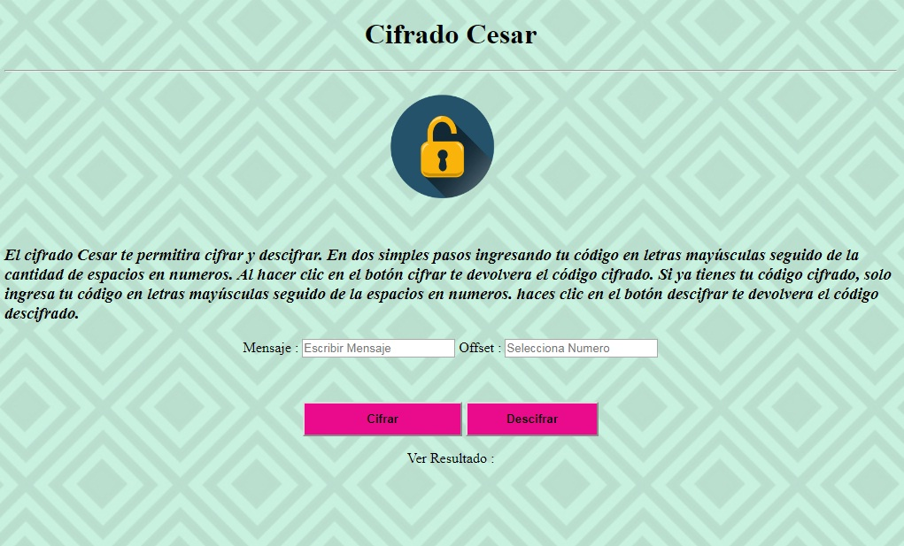

# Cifrado César

## Objetivo
- Se nos pide crear una web la cual permitira a nuestros usuarios manejar una comunacion en codigo, que pida una frase al usuario y devuelva el mismo mensaje encriptado según el algoritmo de Cifrado César con el parámetro de desplazamiento de 33 espacios hacia la derecha
- El programa es capaz de cifrar y descifrar.

### Definición del producto
- Cifrado Cesar es una plataforma Web que permitira al usuario tener una comunicación con sus amigos, familiares. De una forma distinta.
El público objetivo son personas que busquen manejar conversaciones de forma privada. Gracias a Cifrado Cesar, Fiorella y sus amigas lograron tener una fiesta sorpresa para Andrea.

## Diagrama de flujo de la aplicación
El flujo permitira conocer como se maneja nuestra web. En el inicio tenemos una opción de escribir en mayúscula, y poner en números los espacios que se manejaran para cifrar o descifrar.

## Funcionalidad 
- vista inicio para acceder a cifrar y descifrar según corresponda.

- Vista Cifrada , De acuerdo a la opción seleccionada por el usuario. Una vez ingresado los datos a cifrar se selecciona el número de espacio que se considerara con nuestra red a tener la comunicación cifrada. Se considero  mostrar los resultados en la misma página.

- Vista Descrifrada , De acuerdo a la opción seleccionada por el usuario. Una vez ingresado los datos a Descifrar se selecciona el número de espacio que se considero con nuestra red a tener la comunicación cifrada. Se considero  mostrar los resultados en la misma página.

## webSite
* Puede ver el [Proyecto en vivo]
https://nancymontalvo21.github.io/lim-2018-05-bc-core-am-cipher/src/
